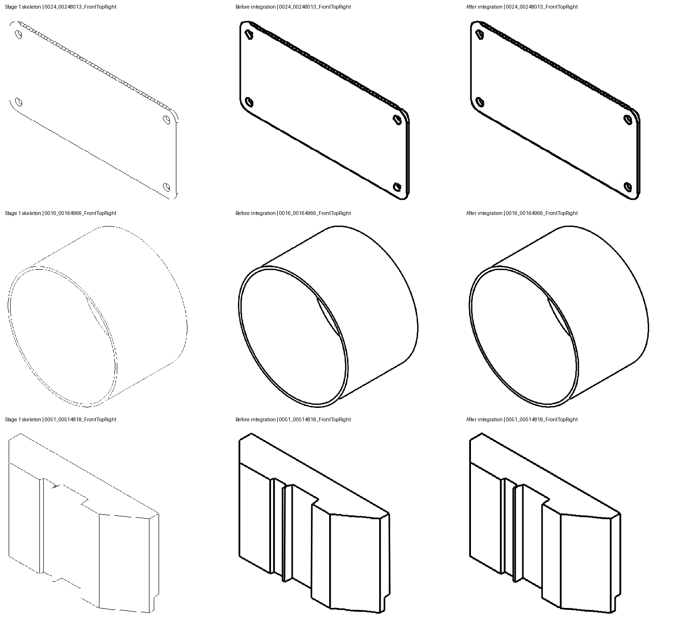

# Stage 2 Recovered Connection Integration

Implementation and evaluation: 2026-09-14. This continues
[source coverage recovery](STAGE2_SOURCE_COVERAGE.md); it does not change
checkpoints, training, dataset generation, acceptance thresholds, or export
stroke widths. The pipeline is still not release-accepted.

## What Changed

`integrate_recovered_connections()` now runs after final source recovery and
before Stage 2 metrics and serialization. It does not rerun the graph simplifier
or its pruning rules.

1. **Interior insertion:** fill a skipped pixel sequence between consecutive
   points of an existing stroke using actual recovered links. The original
   point order remains intact. Searches cover chords at most three pixels long,
   at most four links, and at most one pixel of extra path length. Multiple
   eligible routes are left unresolved as separate traces rather than guessed.
2. **Link-level absorption:** retire only recovered links now traversed by an
   existing stroke. Preserve any unabsorbed prefix, suffix, or branch. Mere
   pixel proximity is not sufficient evidence to remove a trace.
3. **Endpoint splicing:** join chains at exact coordinate contacts with source
   degree two. Source adjacency includes the hatch layer. Interior contacts,
   branch junctions, hatch contacts, dashed geometry, incompatible styles, and
   unsupported gaps are not joined. Corners are retained and genuine cycles
   can close without inventing a straight shortcut.
4. **Preservation checks:** assert exact equality of the before/after main
   pixel sets and preservation of every input edge's pixels across its output
   descendants. Hatch arrays are not modified. Changed traces invalidate stale
   smoothing. The operation is deterministic and tested for idempotence.

The graph records `coverage.recovery.integration` with schema
`ap3-stage2-coverage-integration-v1`: insertion/join/retirement counts,
before/after edge counts, and `input_to_output_edge_ids`. Changed edges retain
`coverage_parent_edge_ids`. Recovery component `edge_ids` describe the input
recovery traces; the integration map resolves them to final graph IDs. Stage 3
ownership checks still use final graph IDs exactly once, not historical IDs.

The ledger adds `recovered_connection_integration` and verifies that the final
unresolved spans still match missing source pixels exactly. This preserves
represented coverage; it does not classify unresolved singletons as noise.

### Stage 3 Safeguard

An initial replay exposed refitting regressions when long integrated strokes
were fitted under the ordinary source tolerance. Integrated strokes now use a
stricter fitting-only check: all sampled bidirectional distances at most one
pixel, with exact open-primitive endpoints where endpoints are defined.
Unsupported candidates try checked refits/anchored paths, then a checked
0.25-pixel simplified or exact source trace. Other fitting routes retain their
existing policy. Conservative trace confidence remains visible to the gates.

This improves the final paired results but does not certify raster stroke
widths, internal branch topology, or unrestricted deployment.

## Verification

**411 tests pass**, including 20 new cases covering interior insertion, endpoint
orientation, partial absorption, overlapping original ownership, branches,
hatch/dashed boundaries, unsupported gaps, ambiguity, corners, closed shapes,
idempotence, ledger integration, and downstream endpoint/detail preservation.

- [Final test report](audits/2026-09-14/integration/tests_final.xml)
- [Evidence and code/artifact hashes](audits/2026-09-14/integration/evidence.json)
- [Fresh-check and diagnostic reproduction script](audits/2026-09-14/integration/evaluate_integration.py)

### Paired Drawing2CAD250

Baseline: `output/Drawing2CAD250_Stage2CoverageV2`.
Final: `output/Drawing2CAD250_CoverageIntegrationV2`.

| Measure | Before | After |
|---|---:|---:|
| Main edges / budget primitives | 5,581 | 1,166 |
| Whole-source geometry passes | 250 / 250 | 250 / 250 |
| Passing primitive checks | 5,581 | 1,166 |
| Mean rendered F1 at 2 px | 0.989766 | 0.993725 |
| Mean symmetric Chamfer | 0.293808 | 0.082270 |
| Unresolved source pixels | 0 | 0 |

This is **79.1% fewer primitives**, with identical represented source pixel sets
in every drawing. F1 improves in 116 views, declines in 13, and ties in 121.
Chamfer improves in 228, worsens in 10, and ties in 12. These are fidelity
measurements against the shared Stage 1 skeleton, not original CAD ground-truth
accuracy or a complete acceptance evaluation.

### Patent Pilot and Canonical Run

Paired diagnostic baseline: patent rows from `output/Stage2CoverageFresh5`,
using their exact graphs from `output/PatentData2_Stage2CoverageSmokeV2`.
Final diagnostic: `output/PatentData2_CoverageIntegrationPilotV3`.
Final canonical run: `output/PatentData2_CoverageIntegrationSmokeV2`.

The fresh canonical run reuses verified Stage 0/1 and reruns the canonical
model-backed Stage 2, followed by gated Stage 3/4. Its final edge arrays match
the diagnostic integration arrays exactly for both patents. Main pixel sets
and all 1,635 hatch edge records are unchanged.

| Measure | EP2565056B1/F0001 | EP3082506B1/F0001 |
|---|---:|---:|
| Main edges before -> after | 656 -> 477 | 527 -> 257 |
| Micro-edge ratio before -> after | 0.68885 -> 0.58887 | 0.63386 -> 0.31950 |
| Short-edge ratio before -> after | 0.72755 -> 0.63597 | 0.71850 -> 0.48133 |
| Source pixels represented | 40,074 / 40,074 | 54,015 / 54,017 |
| Hatch edges unchanged | 1,392 | 243 |
| Interior inserted pixel occurrences | 79 | 303 |
| Retired recovery traces | 73 | 162 |
| Endpoint joins | 106 | 109 |
| Diagnostic F1 before -> after | 0.999938 -> 0.999938 | 0.999824 -> 0.999889 |
| Diagnostic Chamfer before -> after | 0.127931 -> 0.100838 | 0.144994 -> 0.071830 |
| Diagnostic budget after | 1,869 | 500 |
| Canonical execution | Stage 2 gate | Exports SVG/DXF |
| Acceptance / training eligible | rejected / no | rejected / no |

Both patents retain passing checks for every emitted diagnostic primitive:
822 passes in total. Whole geometry passes for EP2565056; EP3082506 still fails
because source singletons at `(597, 1340)` and `(597, 2120)` remain unresolved.
The first drawing still exceeds the 0.50 micro-edge ratio gate, and its
diagnostic stroke budget remains above 900. The second exports canonically but
is rejected for unresolved source pixels, content validation, and unknown
reference text. Its low-confidence fraction increases to 30.4% under the
conservative fitting safeguard; mean fitting confidence still passes.

The final training manifest contains **zero accepted rows**, with two rejected
rows. Diagnostic exports are not training targets. No full Patent91 or
PatentData100 rerun was performed for this implementation.

### Fresh Drawing2CAD Checks

`output/Stage2IntegrationFresh3` reruns the actual D2C Puhachov checkpoint on
the three previously coverage-failing views. Compare with the prior fresh
coverage outputs, not the differently configured frozen CAD250 baseline.

| View | Edges before -> after | Rendered F1 before -> after | Geometry |
|---|---:|---:|---|
| 0026_00267762_Right | 21 -> 6 | 0.991607 -> 0.995192 | pass |
| 0078_00787655_FrontTopRight | 33 -> 7 | 1.000000 -> 0.998899 | pass |
| 0079_00793147_Front | 16 -> 6 | 1.000000 -> 1.000000 | pass |

All three preserve their previous main source sets and hatch records, retain
100% source coverage, and pass Stage 2/3 execution gates. One small rendered
regression remains despite better Chamfer. These fresh diagnostic exports are
not full canonical training acceptance runs.

## Remaining Failures

The largest CAD F1 regression is `0024_00248013_FrontTopRight`:
0.894467 -> 0.818554, a **-0.075913** change. The next two are
`0016_00164966_FrontTopRight` (-0.051659) and
`0051_00514818_FrontTopRight` (-0.019540). These must not be hidden by the mean.



Those three exports inherit widths of 4.33, 4.43, and 4.29 pixels. With a
diagnostic width of 1, all three have F1=1.0 both before and after integration;
their Chamfer improves after integration. This supports a stroke-width/overlap
explanation for these raster regressions, not loss of Stage 2 source pixels.
It does not prove every raster regression has that cause. Actual exported
widths were not changed, and unit-width diagnostics are not acceptance waivers.

Another already poor case, `0089_00896586_Right`, falls from F1 0.019455 to 0:
an eight-pixel-high source is exported with six-pixel stroke width. The full
regression list remains in the evidence JSON.

Initial integration results remain historical in
`output/Drawing2CAD250_CoverageIntegrationV1` and
`output/PatentData2_CoverageIntegrationPilotV2`; the final fitting safeguard
improves both dataset means. `PatentData2_CoverageIntegrationPilotV1` was a
mis-scoped diagnostic invocation against a mixed five-case source: its three
missing-CAD-graph errors are excluded, and the two-patent run was repeated with
explicit folder selection. No evaluation failures were silently reclassified.

## Next Priorities

1. Calibrate exported stroke widths against the cleaned raster, and validate
   rendered topology/overlap as well as centerline support. Address the recorded
   CAD outliers before promoting integrated results to training targets.
2. Resolve remaining hatch-adjacent recovery using source-supported family
   continuation and explicit side-layer ownership. Do not reclassify hatch
   pixels as outlines or delete hatch detail to reduce stroke counts.
3. Add explicit junction/interior-contact handling where degree-two splicing
   cannot decide. Preserve branch topology instead of forcing through-merges.
4. Resolve singleton/content/reference reviews, then expand the paired patent
   evaluation. Existing geometry gates and the 900-stroke budget stay active.

## Reproduction

Run from the repository root. Use new output names when repeating a replay.
CPU checks used `OMP_NUM_THREADS=1 OPENBLAS_NUM_THREADS=1 MKL_NUM_THREADS=1`.

```bash
.venv/bin/python -m pytest tests -q
.venv/bin/python -m tools.replay_fitting_repair \
  --source output/Drawing2CAD250_Stage2CoverageV2 \
  --config output/Drawing2CAD/stage3_open_closed_full/evaluation_config.yaml \
  --output output/Drawing2CAD250_CoverageIntegrationV2 \
  --workers 4 --raster-metrics --integrate-coverage
.venv/bin/python -m tools.replay_fitting_repair \
  --source output/Stage2CoverageFresh5 \
  --graphs output/PatentData2_Stage2CoverageSmokeV2 \
  --folder EP2565056B1 --folder EP3082506B1 --config config_deploy.yaml \
  --output output/PatentData2_CoverageIntegrationPilotV3 \
  --workers 2 --raster-metrics --integrate-coverage
.venv/bin/python -m tools.batch_run --config config_deploy.yaml \
  --worklist docs/audits/2026-09-09/priority0_smoke.csv \
  --reuse-preprocessing-from output/PatentData2_CompactHatchFitSmokeV2 \
  --reuse-preprocessing-config config_deploy.yaml \
  --output output/PatentData2_CoverageIntegrationSmokeV2 --workers 2
.venv/bin/python -m tools.build_training_manifest \
  --db output/PatentData2_CoverageIntegrationSmokeV2/results.db \
  --run-output output/PatentData2_CoverageIntegrationSmokeV2 \
  --config config_deploy.yaml \
  --output-csv output/PatentData2_CoverageIntegrationSmokeV2/training_manifest.csv \
  --rejects-csv output/PatentData2_CoverageIntegrationSmokeV2/training_rejects.csv
.venv/bin/python docs/audits/2026-09-14/integration/evaluate_integration.py \
  --output output/Stage2IntegrationFresh3
```

The diagnostic replay retains its input hashes and marks inherited Stage 2
metrics as not recomputed. It does not masquerade as canonical execution.
Fresh canonical graphs contain recomputed metrics and current deployment
fingerprints. The independent geometry validator remains version 3 and the
acceptance policy remains `2026-09-14.1`.
